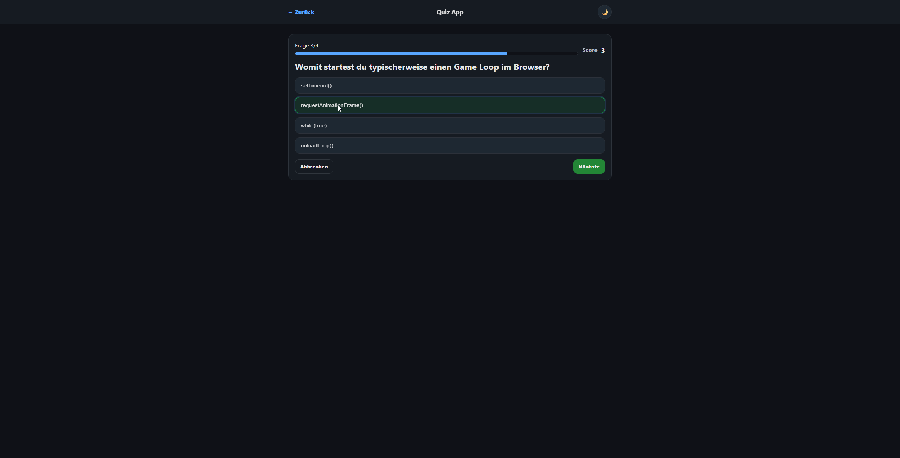

# Web Dev Journey (Void)

Ein kleines Portfolio mit Lernprojekten in **HTML / CSS / JavaScript** – live gehostet über **GitHub Pages**.

## Live Demos
- **Portfolio:** https://void541.github.io/web-dev-journey/
- **To-Do App:** https://void541.github.io/web-dev-journey/todo/

## Projekte

### 1) Mini Portfolio (Projekt 1)
**Highlights**
- Responsive Layout (Desktop/Mobile)
- Dark/Light Theme Toggle (localStorage)
- Navigation + Smooth Scrolling

### 2) To-Do App (Projekt 2)
**Features**
- Add / Delete / Complete
- Filter: Alle / Aktiv / Erledigt
- “Done löschen”
- Speicherung via localStorage
- Dark/Light Theme Toggle

3) Quiz App (Projekt 3)

Features:

Multiple Choice Quiz

Kategorie-Filter (Web / JS / Games / Allgemein)

Optionaler Timer

Highscore (localStorage)

Dark/Light Theme

Tastatur-Steuerung (1–4)

Question Editor im Browser (Custom Fragen)

Fragen aus externer JSON-Datei geladen

📦 Erweiterungen

Fragen werden aus questions.json geladen

Custom Fragen werden im localStorage gespeichert

JSON + Custom werden beim Start gemerged

🎮 Ziel

Langfristiges Ziel:
Aufbau eines modularen Top-Down PvE RPG Browsergames
(Combat-System, Progression, Loot, Map-System)

## Tech Stack
- **HTML5**
- **CSS3** (Flex/Grid, responsive, theme variables)
- **JavaScript** (DOM, Events, localStorage)
- **Git + GitHub Pages**

## Lokal starten
- Portfolio: `index.html` öffnen  
- To-Do App: `todo/index.html` öffnen  
(Optional: VS Code Extension **Live Server**)

## Roadmap
- Projekt 3: **Quiz App**
- Kleine UI-Polish Iterationen
- Weitere JavaScript-Projekte